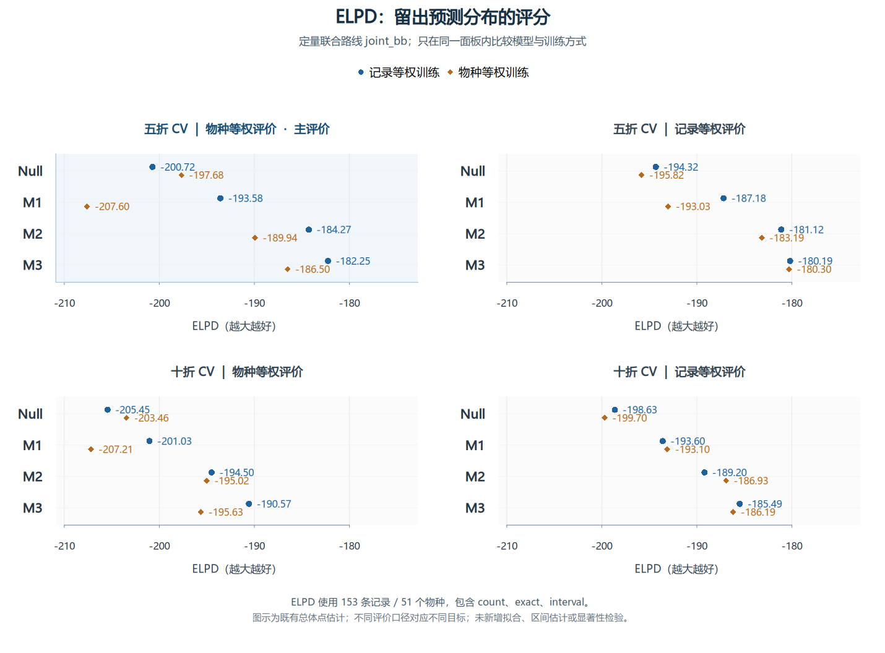
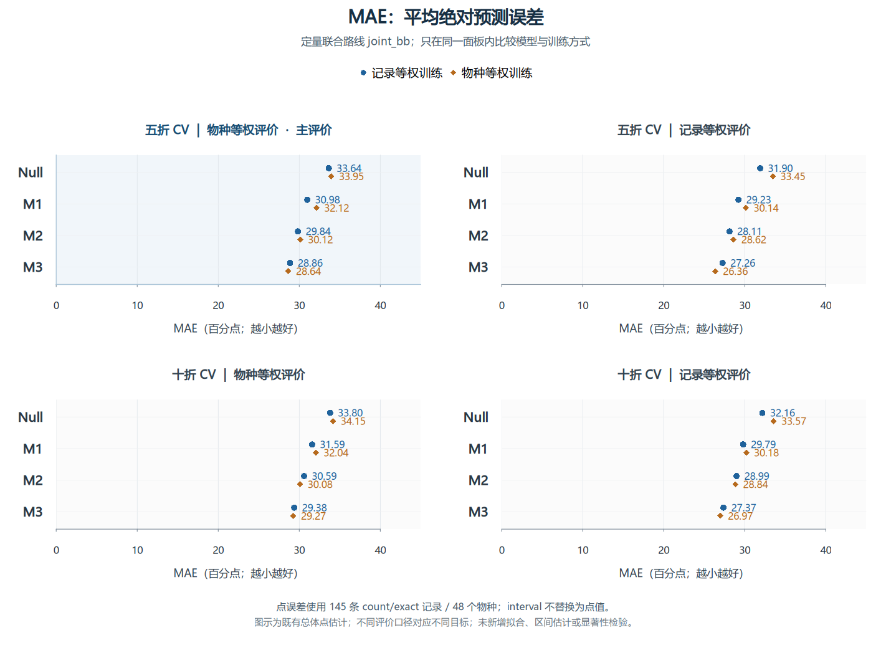
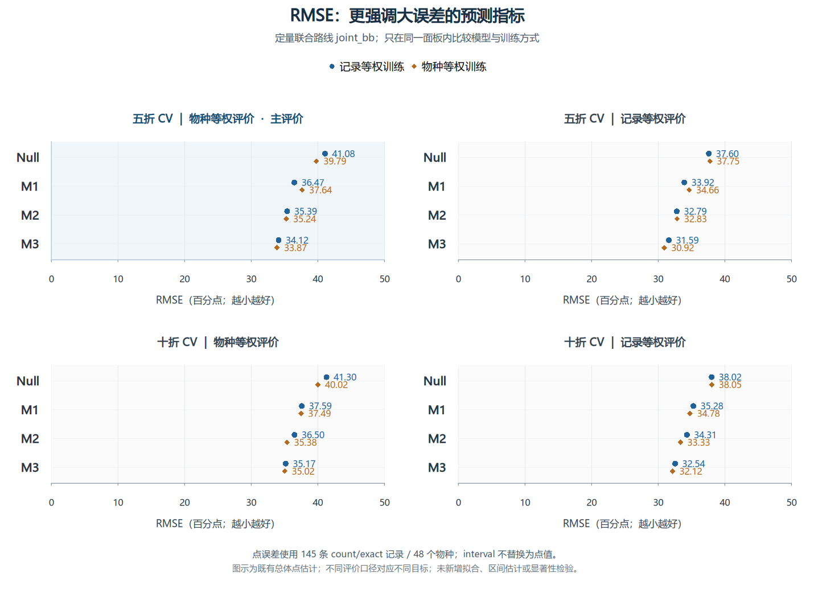
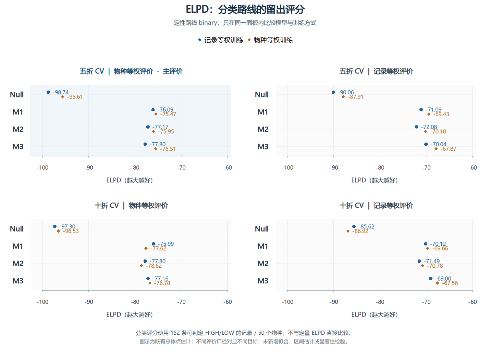

# v3.4 正式结果：ELPD、MAE、RMSE补充图与中文解读

本文件补充现有正式结果的展示与解释。原v3.4报告已列出这些指标，但没有对应的独立比较图，也没有逐项解读。本轮使用已保存CSV，未重新拟合、未改变数据/权重/先验、未新增bootstrap或显著性检验。原正式输出文件的SHA-256仍全部一致。

## 如何读图

每图包含四个面板：上排五折、下排十折；左列物种等权评价、右列记录等权评价。左上角为预先指定的主评价。蓝色圆点为记录等权训练，橙色菱形为物种等权训练。

只在同一面板内比较模型和训练方式。物种等权评价与记录等权评价针对不同目标，不能跨面板挑出一个最高或最低数值宣布赢家。两套CV使用同一批物种，十折是敏感性分析；四种训练—评价组合彼此相关。

三个指标展示完整OOF记录上的既有总体值，不是简单平均各折误差。本轮没有新增误差条；这些点图不能表示差异的不确定性，也不能用它们直接判定统计显著性。

## 指标分别是什么意思

| 指标 | 本项目实际计算 | 好坏方向 | 使用的数据 |
|---|---|---|---|
| ELPD | 评价权重乘每条留出观测的log预测概率/密度，再相加；权重和等于记录数153 | 越大越好，例如-182优于-200 | count、exact、interval合计153条、51物种 |
| MeanLogScore | ELPD除以评价权重和；在本定量总体比较中为ELPD/153 | 越大越好 | 同ELPD |
| MAE | 评价加权的绝对误差平均值 | 越小越好 | count/exact的145条、48物种 |
| RMSE | 评价加权的平方误差平均值再开方，大误差影响更大 | 越小越好 | 同MAE |

MAE/RMSE使用后验均值作为点预测。图中乘100转为“百分点”：MAE=0.2886表示所选评价权重下，每条观测报告的绝对预测误差平均约28.86个百分点。它不表示准确率为71.14%，也不是相对误差28.86%。interval没有唯一观测点，故不参与MAE/RMSE，不使用区间中点代替。

ELPD评价完整预测分布，MAE/RMSE评价点预测，所以三者的排序可以不完全相同。ELPD的绝对值没有这里预设的通用合格线；binary与joint_bb观测模型不同，其ELPD不直接比较。

## 主结果：五折、物种等权评价

| 模型 | 训练方式 | ELPD（越大越好） | MeanLogScore | MAE（百分点） | RMSE（百分点） | Bias（百分点） |
|---|---|---:|---:|---:|---:|---:|
| Null | 记录等权 | -200.72 | -1.3119 | 33.64 | 41.08 | +11.73 |
| Null | 物种等权 | -197.68 | -1.2920 | 33.95 | 39.79 | +6.17 |
| M1 | 记录等权 | -193.58 | -1.2652 | 30.98 | 36.47 | +5.61 |
| M1 | 物种等权 | -207.60 | -1.3569 | 32.12 | 37.64 | +2.10 |
| M2 | 记录等权 | -184.27 | -1.2044 | 29.84 | 35.39 | +6.23 |
| M2 | 物种等权 | -189.94 | -1.2414 | 30.12 | 35.24 | +3.02 |
| M3 | 记录等权 | -182.25 | -1.1912 | 28.86 | 34.12 | +4.98 |
| M3 | 物种等权 | -186.50 | -1.2190 | 28.64 | 33.87 | +3.40 |

- 按主要log score目标，M3记录等权训练的ELPD=-182.25，在此面板中最高。相同训练方式的Null为-200.72，两者相差18.47个本项目定义的加权总log-score单位。
- M3物种等权训练的MAE=28.64个百分点、RMSE=33.87个百分点，是这个面板中最低的点估计。
- 但相对M3记录等权训练，其MAE只减少0.22个百分点、RMSE只减少0.25个百分点；ELPD反而略低。这不支持把物种等权训练概括为所有指标都更好。
- M3记录等权训练相对同训练Null，MAE减少4.78个百分点、RMSE减少6.96个百分点。点预测确有改善，但平均绝对误差仍约29个百分点，实际用途能否接受还需结合目标容许误差讨论。

## 数值改善是否已经有充分的差异证据

下表直接读取已有模型比较结果。Difference和区间是MeanLogScore差，不是MAE/RMSE差；相对Null为正表示log score改善。

| 模型 | 训练方式 | 相对Null的MeanLogScore差 | 95%区间下界 | 上界 | P_approx | P_BH |
|---|---|---:|---:|---:|---:|---:|
| M1 | 记录等权 | +0.0467 | -0.1396 | +0.2204 | 0.6125 | 0.6125 |
| M2 | 记录等权 | +0.1075 | -0.0563 | +0.2664 | 0.1949 | 0.5847 |
| M3 | 记录等权 | +0.1207 | -0.0197 | +0.2698 | 0.1028 | 0.5847 |
| M1 | 物种等权 | -0.0648 | -0.3242 | +0.1464 | 0.5916 | 0.6125 |
| M2 | 物种等权 | +0.0506 | -0.1325 | +0.2048 | 0.5705 | 0.6125 |
| M3 | 物种等权 | +0.0731 | -0.0808 | +0.2197 | 0.3397 | 0.6125 |

对主结果中的M3记录等权训练，差值为+0.1207，95%物种bootstrap近似区间为[-0.0197, +0.2698]，P_approx=0.1028，P_BH=0.5847。区间跨0，目前不能宣称其相对Null具有明确统计显著优势。P值较大也不能证明两者等效。

M3两种训练的MeanLogScore差（物种训练减记录训练）为-0.0278，95%近似区间为[-0.0855, +0.0236]，P_approx=0.3213，P_BH=0.4284。因此也不能据这些结果断言两种训练已有可靠差别。

上述区间来自固定OOF预测下的物种配对bootstrap；P_approx使用近似正态差异统计量，区间则使用bootstrap分位数，二者不是严格反演关系。它们不包含重新训练和模型选择的不确定性。MAE/RMSE目前只有点估计，现有log score的P值不能移用于它们；本轮依照既定范围没有补做MAE/RMSE置信区间或检验。

## 十折敏感性分析

| 模型 | 训练方式 | ELPD（越大越好） | MeanLogScore | MAE（百分点） | RMSE（百分点） | Bias（百分点） |
|---|---|---:|---:|---:|---:|---:|
| Null | 记录等权 | -205.45 | -1.3428 | 33.80 | 41.30 | +11.77 |
| Null | 物种等权 | -203.46 | -1.3298 | 34.15 | 40.02 | +6.21 |
| M1 | 记录等权 | -201.03 | -1.3140 | 31.59 | 37.59 | +7.85 |
| M1 | 物种等权 | -207.21 | -1.3543 | 32.04 | 37.49 | +4.90 |
| M2 | 记录等权 | -194.50 | -1.2713 | 30.59 | 36.50 | +7.35 |
| M2 | 物种等权 | -195.02 | -1.2746 | 30.08 | 35.38 | +3.95 |
| M3 | 记录等权 | -190.57 | -1.2456 | 29.38 | 35.17 | +5.97 |
| M3 | 物种等权 | -195.63 | -1.2787 | 29.27 | 35.02 | +3.49 |

十折下，跨本面板8套拟合，记录等权训练的M3仍给出最高ELPD，物种等权训练的M3给出最低MAE/RMSE。两种M3训练的点误差差距仍小。注意，在仅看物种等权训练时，M2的十折ELPD略高于M3，因此不能概括成“M3在所有训练/评价/设计组合下都最佳”。十折不是独立重复实验。

## 还要同时保留的限制

本次正式采样和最终审计全部通过，这支持这些数值来自约定流程。模型适用性仍需结合训练内PPC的18项提示、校准支持不足/退化状态、预测区间宽度及目标物种外推警告解释。

例如主评价下M3记录等权训练的预测区间覆盖率为97.92%，平均区间宽度约88.68个百分点。高覆盖率伴随很宽的区间，不应单凭覆盖率高便认定预测已足够精确。

## 三项定量比较图

[高清 PNG](snapshot/quantitative_metric_supplement_20260923/ELPD_comparison.png) · [矢量 SVG](snapshot/quantitative_metric_supplement_20260923/ELPD_comparison.svg)

[高清 PNG](snapshot/quantitative_metric_supplement_20260923/MAE_comparison.png) · [矢量 SVG](snapshot/quantitative_metric_supplement_20260923/MAE_comparison.svg)

[高清 PNG](snapshot/quantitative_metric_supplement_20260923/RMSE_comparison.png) · [矢量 SVG](snapshot/quantitative_metric_supplement_20260923/RMSE_comparison.svg)

## 分类ELPD补充图

分类路线仅使用152条可判HIGH/LOW的记录、50个物种。它是另一观测模型的留出log score，不与定量ELPD的绝对值直接比较。定性路线没有本报告中的比例MAE/RMSE。

[分类ELPD高清 PNG](snapshot/quantitative_metric_supplement_20260923/ELPD_binary_comparison.png) · [分类ELPD矢量 SVG](snapshot/quantitative_metric_supplement_20260923/ELPD_binary_comparison.svg)

## 来源、复现和验证

- 正式源文件：[CV总体指标](snapshot/v3.4/results/cv_metrics_summary.csv)、[模型对Null比较](snapshot/v3.4/results/model_vs_null.csv)、[训练方式比较](snapshot/v3.4/results/training_method_comparisons.csv)。
- 可复现脚本：[make_metric_figures.R](snapshot/quantitative_metric_supplement_20260923/make_metric_figures.R)。使用项目既有R 4.6.1 Docker镜像和基础图形设备生成PNG/SVG，中文字体为Microsoft YaHei。最初检查发现宿主Python没有Matplotlib，因此采用已有R环境，未安装新依赖。
- 脚本用法：Rscript make_metric_figures.R VERSION_ROOT OUTPUT_DIR。Linux环境需有图中所用中文字体。
- 定量/分类各32个组的身份已核对；128个实际绘制值逐项回查正式汇总表，MAE/RMSE仅作×100的单位转换。
- PNG已打开校验，SVG已解析，图像目视检查另见visual_check.json；plot_validation.json和supplement_validation.json保存数值及源文件校验结果。
- 本补充目录与原v3.4目录隔离；原正式结果、31个派生输出校验值和最终审计状态保持不变。原生产绘图入口未改，今后重跑时应显式运行这份补图脚本。
- round1目录保留第一次生成的图片、脚本与日志作为中间文件；最终文件位于本目录根层。

网页浏览副本：仅将本地文件链接改为仓库相对链接；原始文件按字节保存在 snapshot/quantitative_metric_supplement_20260923/INTERPRETATION_zh.md，完整归档中亦保留原文。
