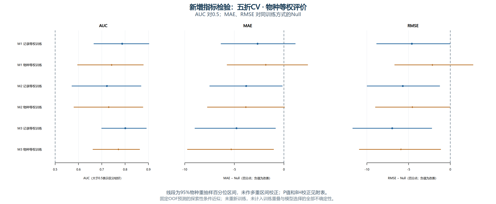

# v3.4：AUC对0.5、MAE和RMSE对Null的补充检验

这是查看ELPD结果后新增的**探索性补充分析**。此前v3.4表中的P值针对MeanLogScore差异；在相同记录与评价权重下，也等价于对应ELPD差异的检验。本文件新增三个不同终点的检验，不能把它们改称原先ELPD检验的结果。

## 本次计算了什么

- AUC：H0为原有“各折AUC等权平均”=0.5，双侧近似检验；没有改成PooledAUC。32行包括8个Null结构性机会水平结果，24项非Null检验。
- MAE：M1/M2/M3与**同训练方式、同折表、同评价权重的Null**作配对比较，H0为MAE_model−MAE_Null=0，共24项。
- RMSE：同样与对应Null作配对比较，H0为RMSE_model−RMSE_Null=0，共24项。每次重抽样均重新计算sqrt(加权平均平方误差)，没有把RMSE误做成绝对误差平均。
- 共80行，其中72项非结构性检验。五折/十折、两种训练和两种评价全部保留。
- 本次没有新增MAE/RMSE两种训练方式之间的检验，也没有做M1、M2、M3所有两两比较；这不是表中P值的含义。

## 计算方法与校正规则

计算前先保存ANALYSIS_PLAN.json，固定50,000次重抽样、种子基数20260923、双侧检验及校正规则。

AUC在原有每一折内，以物种为整组，按HIGH-only、LOW-only、mixed三种物种记录组成分层重抽样，保留每层物种数。一个物种的全部记录一起抽取，重复抽中的物种按独立的bootstrap副本计数。每次重新计算各折的加权AUC并等权平均，不丢弃无效折，不把记录当独立物种。分层是为了保留两类支持，推断因此额外条件于原折表及类别组成。

MAE/RMSE使用count/exact的145条记录、48个物种。以物种配对重抽样，模型和Null共用同一份物种抽样索引；物种等权在有效点值子集内定义。interval不替换成中点。记录等权按抽到的全部记录平均，物种等权按抽到的物种副本等权平均。

原始近似P使用Z=估计差值/bootstrap标准误，再计算双侧正态尾概率2*pnorm(-abs(Z))。区间使用bootstrap百分位数，不是正态P值的严格反演。非常小的P值来自正态尾部外推，**不是50,000次重抽样直接验证了十亿分之一的概率**。

为同时补充三个指标，计算前约定：同一CV设计、同一评价方式下，三指标×三模型×两训练＝18项作为本补充的联合BH家族；同时给出每个指标单独六项的BH列。Null的AUC结构性结果不进入校正家族。两列回答不同的多重比较范围，不能事后只选较小的一列。跨指标校正不保证数值总比单指标校正大，BH还取决于这一组P值的排序。

## 结果概览与解释

五折、物种等权评价仍是主要阅读口径：

- AUC：M1/M2/M3的两种训练共六项，原始及两种BH列均低于0.05。
- MAE：M2记录训练与M3两种训练的原始P低于0.05；但**按MAE单独六项校正，没有一项低于0.05**。三指标18项联合校正下，M3两种训练低于0.05，因此MAE结论对比较家族敏感，不能不加限定地写“MAE显著改善”。
- RMSE：M2记录训练、M3记录训练和M3物种训练，在六项与18项两种校正下都低于0.05。
- 十折敏感性结果并不全部重复五折的误差显著性：物种等权评价下，MAE六项/18项均无低于0.05，RMSE单指标六项也无低于0.05；详细值全部列在后面的表中。

M3记录等权训练在主评价下：AUC=0.8008，MAE相对对应Null减少4.780个百分点，RMSE减少6.961个百分点。M3物种等权训练相应误差减少5.310和5.919个百分点。比较的是不同终点与其基线，不意味着这些模型在所有指标上均有同样强的证据，也不能用“某模型P更小”推断它显著优于另一个非Null模型。

ELPD检查完整预测分布并使用153条记录、51个物种；MAE/RMSE只检查145条点值记录、48个物种的点预测误差。因此，误差指标有改善而ELPD主比较仍不确定，并不矛盾。新增指标不会改写已发表的ELPD结果。

## 重要的推断边界

这些是**固定已训练OOF预测的条件近似P值**，未重新拟合，没有把全部训练集重叠、训练随机性、分折选择和模型选择不确定性纳入。这不是完整训练流程的置换检验，也不是新物种外部验证，不能将极小的近似P当作全流程确证性保证。

AUC还条件于原折号和物种类别组成。十折每折只有5个物种，其中第1、4、5、7折各只有1个带LOW记录的物种，不能从这些折得到充分的LOW类物种间变异信息。已在SupportNote和auc_fold_species_support.csv中明确标记，十折AUC的推断尤其应谨慎。五折每折10物种，带LOW记录的物种至少3个；这仍然是小样本条件近似。

Null在每一折内所有物种预测分数相同，按并列计半分规则AUC恒为0.5。本表用P=1表示没有区分优势，区间[0.5,0.5]为结构性结果，不能解释成数据给出了极高精度。非Null若出现零bootstrap方差则不产生P=0；本次未出现这种退化行。

区间没有做多重区间校正。P＜0.05也不表示比例预测误差足够小；例如M3主评价MAE仍约28.6—28.9个百分点。应连同已有ELPD、PPC、预测区间和外推警告解释。

## 五折 · 物种等权评价

| 模型 | 训练方式 | AUC | 95%条件bootstrap区间 | 原始近似P | 单指标BH（6项） | 三指标BH（18项） |
|---|---|---:|---|---:|---:|---:|
| M1 | 记录等权 | 0.7874 | [0.6664, 0.9020] | 2.103e-06 | 4.207e-06 | 1.262e-05 |
| M1 | 物种等权 | 0.7423 | [0.5963, 0.8779] | 0.00080 | 0.00119 | 0.00358 |
| M2 | 记录等权 | 0.7219 | [0.5722, 0.8679] | 0.00332 | 0.00332 | 0.00996 |
| M2 | 物种等权 | 0.7299 | [0.5808, 0.8761] | 0.00235 | 0.00282 | 0.00846 |
| M3 | 记录等权 | 0.8008 | [0.6997, 0.8909] | 8.626e-10 | 5.176e-09 | 1.553e-08 |
| M3 | 物种等权 | 0.7714 | [0.6623, 0.8621] | 1.257e-07 | 3.770e-07 | 1.131e-06 |

| 指标 | 模型 | 训练方式 | 模型值（百分点） | Null值（百分点） | 模型−Null（百分点） | 95%差值区间（百分点） | 原始近似P | 单指标BH（6项） | 三指标BH（18项） |
|---|---|---|---:|---:|---:|---|---:|---:|---:|
| MAE | M1 | 记录等权 | 30.983 | 33.640 | -2.657 | [-6.336, +1.141] | 0.16184 | 0.19421 | 0.18207 |
| MAE | M1 | 物种等权 | 32.123 | 33.950 | -1.827 | [-5.724, +2.394] | 0.37787 | 0.37787 | 0.37787 |
| MAE | M2 | 记录等权 | 29.837 | 33.640 | -3.804 | [-7.477, -0.169] | 0.04116 | 0.07986 | 0.05699 |
| MAE | M2 | 物种等权 | 30.117 | 33.950 | -3.833 | [-7.712, +0.066] | 0.05324 | 0.07986 | 0.06389 |
| MAE | M3 | 记录等权 | 28.860 | 33.640 | -4.780 | [-8.968, -0.856] | 0.02087 | 0.06262 | 0.03415 |
| MAE | M3 | 物种等权 | 28.640 | 33.950 | -5.310 | [-9.724, -1.046] | 0.01621 | 0.06262 | 0.03090 |
| RMSE | M1 | 记录等权 | 36.475 | 41.083 | -4.609 | [-8.823, -0.024] | 0.03988 | 0.05517 | 0.05699 |
| RMSE | M1 | 物种等权 | 37.644 | 39.787 | -2.144 | [-6.658, +2.720] | 0.37159 | 0.37159 | 0.37787 |
| RMSE | M2 | 记录等权 | 35.392 | 41.083 | -5.691 | [-9.966, -1.276] | 0.01021 | 0.03062 | 0.02296 |
| RMSE | M2 | 物种等权 | 35.243 | 39.787 | -4.544 | [-8.970, -0.053] | 0.04598 | 0.05517 | 0.05911 |
| RMSE | M3 | 记录等权 | 34.122 | 41.083 | -6.961 | [-11.685, -2.228] | 0.00403 | 0.02416 | 0.01035 |
| RMSE | M3 | 物种等权 | 33.868 | 39.787 | -5.919 | [-10.904, -1.158] | 0.01717 | 0.03433 | 0.03090 |

## 五折 · 记录等权评价

| 模型 | 训练方式 | AUC | 95%条件bootstrap区间 | 原始近似P | 单指标BH（6项） | 三指标BH（18项） |
|---|---|---:|---|---:|---:|---:|
| M1 | 记录等权 | 0.6796 | [0.5842, 0.8142] | 0.00269 | 0.00538 | 0.00693 |
| M1 | 物种等权 | 0.6660 | [0.5573, 0.8028] | 0.00886 | 0.01027 | 0.01628 |
| M2 | 记录等权 | 0.6592 | [0.5518, 0.7893] | 0.00947 | 0.01027 | 0.01628 |
| M2 | 物种等权 | 0.6606 | [0.5506, 0.7925] | 0.01027 | 0.01027 | 0.01628 |
| M3 | 记录等权 | 0.7908 | [0.6938, 0.8455] | 5.704e-14 | 3.422e-13 | 1.027e-12 |
| M3 | 物种等权 | 0.7512 | [0.6479, 0.8179] | 6.440e-09 | 1.932e-08 | 5.796e-08 |

| 指标 | 模型 | 训练方式 | 模型值（百分点） | Null值（百分点） | 模型−Null（百分点） | 95%差值区间（百分点） | 原始近似P | 单指标BH（6项） | 三指标BH（18项） |
|---|---|---|---:|---:|---:|---|---:|---:|---:|
| MAE | M1 | 记录等权 | 29.229 | 31.901 | -2.672 | [-5.741, +0.377] | 0.08369 | 0.08369 | 0.08861 |
| MAE | M1 | 物种等权 | 30.135 | 33.454 | -3.319 | [-6.508, +0.606] | 0.06747 | 0.08096 | 0.07590 |
| MAE | M2 | 记录等权 | 28.113 | 31.901 | -3.789 | [-6.918, -0.968] | 0.01197 | 0.01796 | 0.01658 |
| MAE | M2 | 物种等权 | 28.616 | 33.454 | -4.838 | [-8.167, -1.314] | 0.00534 | 0.01068 | 0.01201 |
| MAE | M3 | 记录等权 | 27.265 | 31.901 | -4.637 | [-7.847, -1.731] | 0.00270 | 0.00809 | 0.00693 |
| MAE | M3 | 物种等权 | 26.357 | 33.454 | -7.097 | [-10.778, -2.990] | 0.00039 | 0.00233 | 0.00233 |
| RMSE | M1 | 记录等权 | 33.918 | 37.597 | -3.678 | [-7.529, +0.074] | 0.05599 | 0.06719 | 0.06719 |
| RMSE | M1 | 物种等权 | 34.657 | 37.754 | -3.098 | [-7.161, +1.608] | 0.16416 | 0.16416 | 0.16416 |
| RMSE | M2 | 记录等权 | 32.787 | 37.597 | -4.810 | [-8.705, -1.296] | 0.01085 | 0.01996 | 0.01628 |
| RMSE | M2 | 物种等权 | 32.832 | 37.754 | -4.923 | [-8.807, -0.968] | 0.01330 | 0.01996 | 0.01710 |
| RMSE | M3 | 记录等权 | 31.594 | 37.597 | -6.002 | [-9.908, -2.440] | 0.00158 | 0.00473 | 0.00567 |
| RMSE | M3 | 物种等权 | 30.915 | 37.754 | -6.839 | [-10.912, -2.586] | 0.00125 | 0.00473 | 0.00564 |

## 十折 · 物种等权评价

| 模型 | 训练方式 | AUC | 95%条件bootstrap区间 | 原始近似P | 单指标BH（6项） | 三指标BH（18项） |
|---|---|---:|---|---:|---:|---:|
| M1 | 记录等权 | 0.7688 | [0.6656, 0.8689] | 2.397e-07 | 7.192e-07 | 2.158e-06 |
| M1 | 物种等权 | 0.7688 | [0.6580, 0.8750] | 1.210e-06 | 1.815e-06 | 5.446e-06 |
| M2 | 记录等权 | 0.7480 | [0.6496, 0.8427] | 5.450e-07 | 1.090e-06 | 3.270e-06 |
| M2 | 物种等权 | 0.7118 | [0.6209, 0.8022] | 5.309e-06 | 6.371e-06 | 1.911e-05 |
| M3 | 记录等权 | 0.7554 | [0.6608, 0.8483] | 9.755e-08 | 5.853e-07 | 1.756e-06 |
| M3 | 物种等权 | 0.7260 | [0.6120, 0.8306] | 5.534e-05 | 5.534e-05 | 0.00017 |

| 指标 | 模型 | 训练方式 | 模型值（百分点） | Null值（百分点） | 模型−Null（百分点） | 95%差值区间（百分点） | 原始近似P | 单指标BH（6项） | 三指标BH（18项） |
|---|---|---|---:|---:|---:|---|---:|---:|---:|
| MAE | M1 | 记录等权 | 31.587 | 33.801 | -2.214 | [-5.853, +1.430] | 0.23219 | 0.23219 | 0.23219 |
| MAE | M1 | 物种等权 | 32.040 | 34.153 | -2.112 | [-5.430, +1.444] | 0.22782 | 0.23219 | 0.23219 |
| MAE | M2 | 记录等权 | 30.588 | 33.801 | -3.213 | [-7.130, +0.589] | 0.10071 | 0.15106 | 0.12085 |
| MAE | M2 | 物种等权 | 30.080 | 34.153 | -4.072 | [-8.100, -0.141] | 0.04404 | 0.08809 | 0.07046 |
| MAE | M3 | 记录等权 | 29.377 | 33.801 | -4.424 | [-8.808, -0.367] | 0.04029 | 0.08809 | 0.07046 |
| MAE | M3 | 物种等权 | 29.268 | 34.153 | -4.885 | [-9.678, -0.447] | 0.03769 | 0.08809 | 0.07046 |
| RMSE | M1 | 记录等权 | 37.590 | 41.302 | -3.712 | [-7.910, +0.455] | 0.08206 | 0.09847 | 0.10551 |
| RMSE | M1 | 物种等权 | 37.489 | 40.022 | -2.532 | [-6.415, +1.524] | 0.20804 | 0.20804 | 0.23219 |
| RMSE | M2 | 记录等权 | 36.500 | 41.302 | -4.803 | [-9.372, -0.399] | 0.03604 | 0.07700 | 0.07046 |
| RMSE | M2 | 物种等权 | 35.375 | 40.022 | -4.646 | [-9.392, -0.185] | 0.04697 | 0.07700 | 0.07046 |
| RMSE | M3 | 记录等权 | 35.171 | 41.302 | -6.131 | [-11.197, -1.384] | 0.01447 | 0.07700 | 0.03721 |
| RMSE | M3 | 物种等权 | 35.024 | 40.022 | -4.997 | [-10.258, -0.221] | 0.05133 | 0.07700 | 0.07108 |

## 十折 · 记录等权评价

| 模型 | 训练方式 | AUC | 95%条件bootstrap区间 | 原始近似P | 单指标BH（6项） | 三指标BH（18项） |
|---|---|---:|---|---:|---:|---:|
| M1 | 记录等权 | 0.7399 | [0.6452, 0.8348] | 5.999e-07 | 7.199e-07 | 2.160e-06 |
| M1 | 物种等权 | 0.7891 | [0.6511, 0.8701] | 3.157e-07 | 4.736e-07 | 1.421e-06 |
| M2 | 记录等权 | 0.7467 | [0.6451, 0.8274] | 6.410e-08 | 1.923e-07 | 5.769e-07 |
| M2 | 物种等权 | 0.7295 | [0.6291, 0.8070] | 2.297e-07 | 4.594e-07 | 1.378e-06 |
| M3 | 记录等权 | 0.7980 | [0.6710, 0.8620] | 2.909e-09 | 1.745e-08 | 5.236e-08 |
| M3 | 物种等权 | 0.7772 | [0.6176, 0.8532] | 6.692e-06 | 6.692e-06 | 2.008e-05 |

| 指标 | 模型 | 训练方式 | 模型值（百分点） | Null值（百分点） | 模型−Null（百分点） | 95%差值区间（百分点） | 原始近似P | 单指标BH（6项） | 三指标BH（18项） |
|---|---|---|---:|---:|---:|---|---:|---:|---:|
| MAE | M1 | 记录等权 | 29.795 | 32.165 | -2.370 | [-4.803, +0.297] | 0.06603 | 0.06603 | 0.06603 |
| MAE | M1 | 物种等权 | 30.184 | 33.567 | -3.383 | [-5.687, -0.526] | 0.01030 | 0.01545 | 0.01426 |
| MAE | M2 | 记录等权 | 28.986 | 32.165 | -3.179 | [-5.752, -0.529] | 0.01592 | 0.01910 | 0.02046 |
| MAE | M2 | 物种等权 | 28.837 | 33.567 | -4.730 | [-7.748, -1.560] | 0.00243 | 0.00666 | 0.00546 |
| MAE | M3 | 记录等权 | 27.369 | 32.165 | -4.796 | [-7.925, -1.527] | 0.00333 | 0.00666 | 0.00666 |
| MAE | M3 | 物种等权 | 26.973 | 33.567 | -6.594 | [-10.496, -2.268] | 0.00177 | 0.00666 | 0.00456 |
| RMSE | M1 | 记录等权 | 35.281 | 38.019 | -2.738 | [-5.578, +0.148] | 0.05929 | 0.05929 | 0.06278 |
| RMSE | M1 | 物种等权 | 34.779 | 38.050 | -3.271 | [-5.963, -0.137] | 0.02735 | 0.03282 | 0.03077 |
| RMSE | M2 | 记录等权 | 34.314 | 38.019 | -3.705 | [-6.943, -0.666] | 0.01967 | 0.02951 | 0.02361 |
| RMSE | M2 | 物种等权 | 33.330 | 38.050 | -4.721 | [-8.431, -1.153] | 0.00999 | 0.01998 | 0.01426 |
| RMSE | M3 | 记录等权 | 32.539 | 38.019 | -5.480 | [-9.504, -1.876] | 0.00478 | 0.01998 | 0.00861 |
| RMSE | M3 | 物种等权 | 32.125 | 38.050 | -5.926 | [-10.207, -1.648] | 0.00668 | 0.01998 | 0.01093 |

## 主评价下的差值与区间图

[矢量SVG](source/additional_metrics/primary_supplementary_tests.svg)

## 验证与复现

- 18项确定性检查通过，包括手算加权AUC、物种副本权重、并列分数、无效折拒绝、RMSE与MAE反例、结构性Null及非Null零方差处理。
- 96个指标点值与原正式汇总表一致，最大误差约5e-16。
- 80组完整bootstrap差值向量已保存；从中选定240个实际重抽样实例，逐条复制物种记录后用原指标函数独立复算，最大误差约2.22e-16。
- 独立Python正态尾概率和BH排序算法复核通过，最大误差约2e-15。
- 原有31个正式派生文件的SHA-256保持不变；没有新拟合、没有覆盖原P值文件。

关键文件：

- [全部80行结果](source/additional_metrics/supplementary_metric_tests.csv)
- [AUC对0.5](source/additional_metrics/auc_tests.csv)
- [MAE对Null](source/additional_metrics/mae_tests.csv)
- [RMSE对Null](source/additional_metrics/rmse_tests.csv)
- [计算前固定的分析方案](source/additional_metrics/ANALYSIS_PLAN.json)
- [每折类别与物种支持](source/additional_metrics/auc_fold_species_support.csv)
- [完整重抽样差值](source/additional_metrics/bootstrap_difference_draws.rds)
- [物种抽样索引与分组数据](source/additional_metrics/bootstrap_species_multiplicities.rds)
- [计算脚本](source/additional_metrics/calculate_supplement_tests.R)
- [计算函数](source/additional_metrics/supplement_functions.R)
- [独立核验结果](source/additional_metrics/independent_validation.json)

复现命令（使用项目R环境）：

~~~text
Rscript test_supplement_functions.R OUTPUT_DIR V3_4_ROOT
Rscript calculate_supplement_tests.R V3_4_ROOT OUTPUT_DIR
Rscript verify_bootstrap_results.R V3_4_ROOT OUTPUT_DIR
~~~

方法背景：项目原R/metrics.R和R/cross_validation.R定义指标；[LeDell等关于CV-AUC的论文](https://pmc.ncbi.nlm.nih.gov/articles/PMC4533123/)讨论按验证折平均的目标；[pROC源码](https://github.com/xrobin/pROC/blob/master/R/ci.auc.R)说明其常规AUC bootstrap与分层处理。本补充按本项目物种聚类和评价权重自行实现，未直接套用记录独立的DeLong或pROC检验，也未声称文献保证本项目小样本下的精确检验水平。
